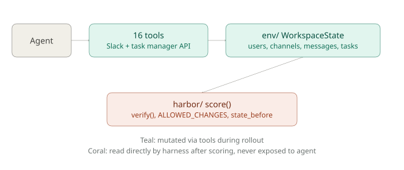
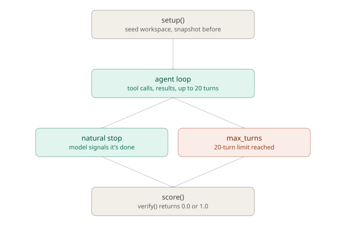

# Apollo

A Harbor-compatible RL evaluation environment built around two simulated workplace services: a Slack-like messaging system and a task manager. The primary evaluation task (`vendor_reconcile`) requires an agent to investigate a vendor payment discrepancy across noisy multi-channel history, open a fix task assigned to the correct engineer, and confirm the finding in the right thread.

## The task

The agent is given a single instruction and nothing else:

> "Finance flagged that one of our vendor payments this month doesn't reconcile. Figure out which vendor was short-paid, open a task for the right person to fix it, and reply in the finance lead's thread to confirm. If the numbers actually check out, don't create anything, just say so in the thread."

It's dropped into a seeded workspace of 88 messages, 16 tasks, 14 users, and 9 channels (some private, some it has no access to). The relevant facts -- the actual payment amount, the contracted amount, and who has the authority to confirm a fix -- are scattered across two channels and contradicted by at least one other employee along the way. There is no shortcut: a keyword search for the obvious term surfaces an unrelated standup note that anchors weaker models on the wrong person before they ever read the channel where the real dispute plays out.

The agent has no visibility into how it's being graded. It only sees the 16 Slack/task-manager tools and the instruction above.

## Workspace explorer

`apollo_workspace_explorer.html` is a standalone, static page for browsing the seeded workspace -- it is **not** part of the RL environment and is not used by the agent or the verifier. It exists purely so a reviewer can see what the agent is actually working with: every channel, every thread, and the full task list, exactly as seeded at `episode_start`.

Open it in any browser (no server needed). Two things worth using:

- **Search** mirrors `search_messages` -- type a query to see what a substring search across all accessible channels returns.
- **Task annotations** toggle overlays the design intent on the relevant messages: which ones are _signal_ (point toward the correct answer), _trap_ (look relevant but mislead), or _context_ (background noise).

## Architecture and agent isolation

The environment is split into a stable simulation layer (`env/`), one file per task (`tasks/`), and a harness adapter (`harbor/`) that bridges the two. The single most important property: **the agent can only reach the workspace through its 16 tools.** The verifier, the `ALLOWED_CHANGES` spec, the `state_before` snapshot, and the score itself are read directly by the harness after the rollout and are never exposed as a tool, a tool result, or a field on the live state.



### Slack tools (10)

| Tool                                              | Description                                      |
| ------------------------------------------------- | ------------------------------------------------ |
| `list_channels`                                   | Channels the current user is a member of         |
| `get_channel_messages(channel_id, limit, cursor)` | Top-level messages, paginated, newest-first      |
| `get_thread(message_id)`                          | Replies to a message, oldest-first               |
| `search_messages(query, limit, cursor)`           | Substring search across accessible channels      |
| `post_message(channel_id, text, parent_id)`       | Post a message, or a reply if `parent_id` is set |
| `update_message(message_id, text)`                | Edit a message you authored                      |
| `add_reaction(message_id, emoji)`                 | Add an emoji reaction                            |
| `create_channel(name, is_private)`                | Create a new channel                             |
| `add_member(channel_id, user_id)`                 | Add a user to a channel                          |
| `list_users`                                      | List all users with id, name, role, email        |

### Task manager tools (6)

| Tool                                                      | Description                                            |
| --------------------------------------------------------- | ------------------------------------------------------ |
| `create_task(title, description, assignee, status)`       | Create a task (`status` defaults to `todo`)            |
| `get_task(task_id)`                                       | Fetch a single task                                    |
| `delete_task(task_id)`                                    | Delete a task                                          |
| `list_tasks(assignee, status)`                            | List tasks, optionally filtered                        |
| `update_task(task_id, ...fields)`                         | Partial update of a task                               |
| `search_tasks(query, assignee, status, slack_message_id)` | Search/filter tasks, including by linked Slack message |

## How a trial runs, and how it's scored

Each trial is independent: `setup()` builds a fresh seeded workspace and snapshots it as `state_before` _before_ the agent does anything. The agent then loops -- tool calls in, results back -- until it stops on its own or hits the 20-turn limit. Either way, `score()` runs afterward against the live final state.



`verify(state_before, state_after, trajectory)` checks 5 binary conditions for `vendor_reconcile` -- a fix task was created and names the right vendor, it's assigned to the right engineer, a reply landed in the right thread and names the vendor, and nothing changed beyond exactly that one task and one message (`ALLOWED_CHANGES`). Scoring is **AND**: all 5 must pass for a score of 1.0, otherwise 0.0. Per-assertion results are still recorded in every transcript, so a 0.0 trial shows exactly which check(s) failed.

## Results

Both the target model (Gemma 4 26B) and a stronger reference model (Claude Sonnet 4.5) were run for 5 trials each against `vendor_reconcile`. `docs/results.html` has the full breakdown -- success rate, pass@k, per-assertion pass rates, failure-stage distribution, and annotated trajectory samples for both models.

## How to run

Install dependencies:

```
uv sync
```

Run a single trial:

```
uv run python -m runner.run_trials --task vendor_reconcile --trials 1 --model google/gemma-4-26b-a4b-it
```

Results are written to `transcripts/<task>_<model>_<timestamp>/` (one `trial_NN.json` per trial, plus `summary.json`). The included `docs/results.html` is the pre-generated results page from the evaluation run; open it in a browser.

Run the test suite:

```
uv run pytest -q
```

## Repo structure

- `env/` -- simulation layer: state schema, Slack service, task service, clock, ID generation, workspace seeds
- `tasks/` -- one file per task (`vendor_reconcile.py` is the primary deliverable; `smoke_test.py` verifies harness wiring)
- `harbor/` -- Harbor adapter and trajectory logger; bridges the env to the runner
- `verifiers/` -- shared verifier utilities (collateral damage check, field equality, message existence)
- `runner/` -- CLI trial loop, aggregate reporting, sweep support

## Notes on docs

`docs/` contain working design notes etc from development (with Claude Code) and may not reflect the final code exactly. This README is the current source of truth for how to run and understand the repo.
